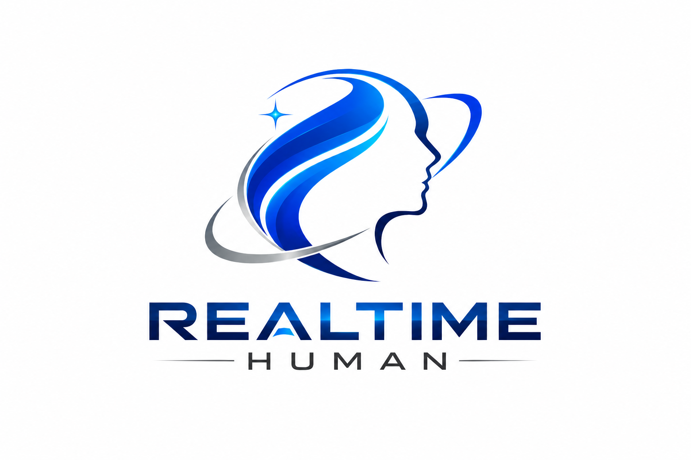
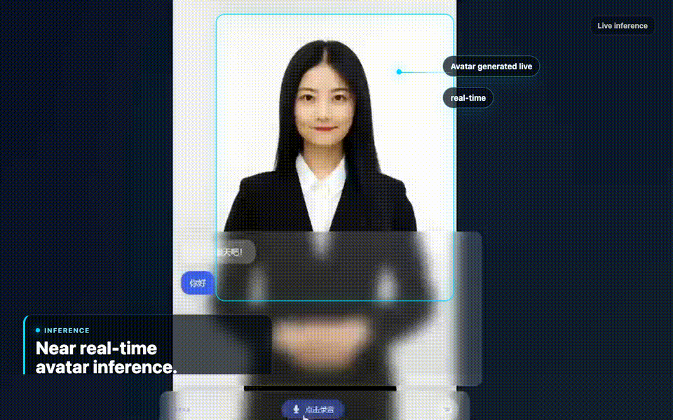
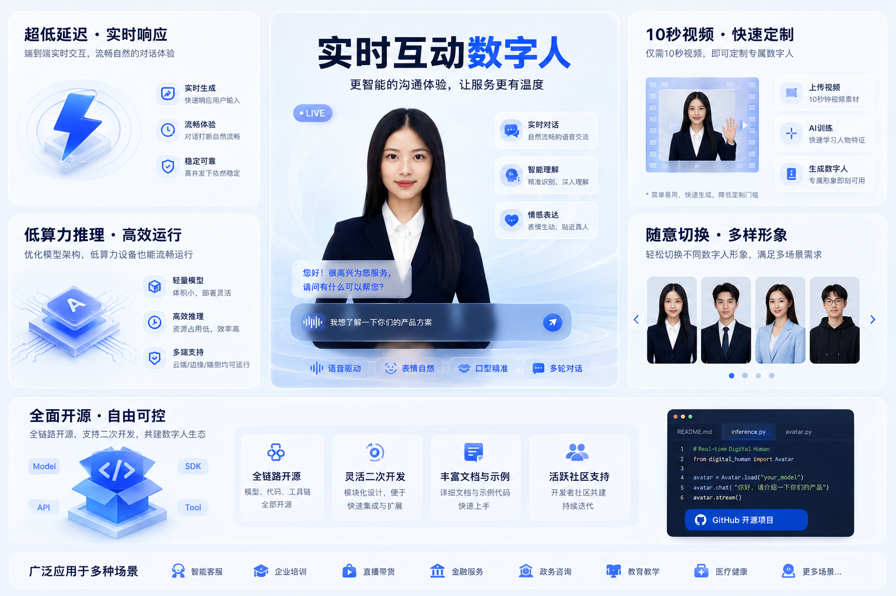

<div align="center">
  

# Realtime Human

**Real-time interactive digital human system with voice conversation**

An open-source, full-stack digital human platform. Upload a video, train a character, and have real-time voice conversations through a browser. No GPU required on the client side.

[English](#features) | [中文文档](README_CN.md)

</div>

<div align="center">
  
</div>

<div align="center">
  
</div>

https://github.com/user-attachments/assets/5aaf672b-5090-4ef5-a014-f160668dffce

---

## Features

- **One-video character creation** — Upload a single face video, the training pipeline automatically extracts face keypoints, builds a 3D mesh, and generates animation data
- **Real-time voice conversation** — Speak to the digital human and get streaming audio+text responses powered by ASR + LLM + TTS
- **GPU-free browser rendering** — WebGL + WASM renders the talking face in real-time, runs on any device with a modern browser
- **Multi-character switching** — Create and deploy multiple digital human characters, switch between them instantly
- **Full-stack open source** — Frontend (React + WebGL), training server (FastAPI + PyTorch), voice backend (.NET 9), all included

## Showcase

<div align="center">
  
</div>

## Architecture

```
                         ┌──────────────────────┐
                         │     User Browser      │
                         │  ┌────────────────┐   │
                         │  │ React + WebGL  │   │
                         │  │ + WASM Module  │   │
                         │  └───────┬────────┘   │
                         └──────────┼─────────────┘
                          WebSocket │     HTTP
                      ws://*:19465  │  http://*:5173
                                    │
                 ┌──────────────────┴───────────────────┐
                 │                                      │
        ┌────────▼────────┐                   ┌─────────▼─────────┐
        │  Voice Server   │                   │  React Frontend   │
        │   (.NET 9)      │                   │   (Vite dev)      │
        │                 │                   │                   │
        │ ASR → LLM → TTS │                   │ WebGL face render │
        └───┬────┬────┬───┘                   │ WASM audio proc   │
            │    │    │                        │ Chat UI           │
            │    │    │                        └───────────────────┘
            ▼    ▼    ▼
        ┌─────┐┌───┐┌─────┐
        │FunASR││LLM││ TTS │
        │(ASR) ││   ││     │
        └─────┘└───┘└─────┘


    ── Character Training Flow ──────────────────────────────

    ┌──────────────┐    Upload video     ┌──────────────────┐
    │ Admin Browser │ ──────────────────  │ Training Server  │
    │  (port 8000)  │ ◄── SSE progress ── │   (FastAPI)      │
    └──────────────┘                      │                  │
                                          │ 6-step pipeline: │
                                          │  1. Video → 25fps │
                                          │  2. Face keypoints│
                                          │  3. Mouth crop    │
                                          │  4. 3D mesh gen   │
                                          │  5. DINet features│
                                          │  6. Package gzip  │
                                          └────────┬─────────┘
                                                   │ Deploy
                                                   ▼
                                          ┌──────────────────┐
                                          │ characters/ dir  │
                                          │  01.mp4          │
                                          │  data (gzip)     │
                                          │  preview.jpg     │
                                          └──────────────────┘
```

## Quick Start

> **Two concepts to know before you start:**
> - **Creating a character** = upload a face video, the pipeline uses pre-trained models to generate animation data (~2MB per character). No model training needed.
> - **Training models** = training DINet / LSTM from scratch. Only needed if you want custom model weights. See [Advanced: Train Models from Scratch](#advanced-train-models-from-scratch).

### Prerequisites

| Dependency | Version | Purpose |
|-----------|---------|---------|
| Python | 3.11+ | Character creation pipeline |
| Node.js | 18+ | Frontend |
| .NET SDK | 9.0 | Voice backend server |
| FFmpeg | any | Video processing (must be in PATH) |

### 1. Clone the repo

```bash
git clone https://github.com/your-username/Realtime_human.git
cd Realtime_human
```

### 2. Download pre-trained checkpoints

The character creation pipeline needs pre-trained model weights. Download them and place in `dhy_human/checkpoint/`:

```
dhy_human/checkpoint/
├── DINet_mini/
│   └── epoch_40.pth              # DINet render model
├── lstm/
│   └── lstm_model_epoch_325.pkl  # Audio-to-blendshape LSTM
├── audio.pkl                     # Audio feature model
└── pca.pkl                       # PCA for blendshape decomposition
```

These models are trained following the methodology from [DH_live](https://github.com/kleinlee/DH_live). If you want to train your own, see [Advanced: Train Models from Scratch](#advanced-train-models-from-scratch).

### 3. Start the character creation server

```bash
cd dhy_human

# Create conda environment (recommended)
conda create -n realtime_human python=3.11
conda activate realtime_human

# Install dependencies
pip install torch --index-url https://download.pytorch.org/whl/cu124   # GPU
# or: pip install torch                                                 # CPU only
pip install -r requirements.txt
pip install -r living_human/training_server/requirements.txt

# Start the server
cd living_human/training_server
python server.py
```

The character creation server runs on http://localhost:8000.

### 4. Start the voice server

Open a new terminal:

```bash
cd voice_server

# Copy the example config and fill in your API keys
cp appsettings.Example.json appsettings.json

# Install dependencies and run
dotnet restore
dotnet run
```

Edit `appsettings.json` with your credentials. Here's what each field means:

#### LLM — Large Language Model (chat completions)

```json
"LLM": {
  "Model": "deepseek-v3-250324",
  "Token": "YOUR_VOLCENGINE_ARK_API_KEY",
  "ApiEndpoint": "https://ark.cn-beijing.volces.com/api/v3/chat/completions"
}
```

| Field | Description |
|-------|------------|
| `Model` | Model name to use (default: DeepSeek-V3 on Volcengine ARK) |
| `Token` | API key for the chat completions service |
| `ApiEndpoint` | OpenAI-compatible chat completions URL |

The default config uses [Volcengine ARK](https://www.volcengine.com/product/ark). You can also use any OpenAI-compatible endpoint (e.g., DeepSeek official API, local Ollama). Just change `ApiEndpoint` and `Token` accordingly.

#### TTS — Text to Speech

```json
"TTS": {
  "HuoShan": {
    "AppId": "YOUR_HUOSHAN_APP_ID",
    "Token": "YOUR_HUOSHAN_TOKEN"
  },
  "Clone": {
    "AppId": "YOUR_CLONE_APP_ID",
    "Token": "YOUR_CLONE_TOKEN"
  },
  "Coze": {
    "Key": ""
  },
  "DefaultVoiceType": "BV700_streaming"
}
```

| Field | Description |
|-------|------------|
| `TTS.HuoShan.AppId` / `Token` | [HuoShan TTS](https://www.volcengine.com/product/tts) credentials (required, primary TTS backend) |
| `TTS.Clone.AppId` / `Token` | Voice clone TTS credentials (optional, for custom voice cloning) |
| `TTS.Coze.Key` | [Coze](https://www.coze.com/) API key (optional, alternative TTS backend) |
| `DefaultVoiceType` | Default voice type ID (e.g., `BV700_streaming`, `BV007_streaming`) |

#### Communication — ASR & Server

```json
"Communication": {
  "FunasrUrl": "ws://YOUR_FUNASR_HOST:10095/",
  "ListenerPrefix": "http://+:19465/"
}
```

| Field | Description |
|-------|------------|
| `FunasrUrl` | [FunASR](https://github.com/modelscope/FunASR) WebSocket address for speech-to-text |
| `ListenerPrefix` | The voice server's own listening address (default: all interfaces on port 19465) |

**FunASR setup:** FunASR is an open-source ASR engine by Alibaba DAMO Academy. Deploy it with Docker:

```bash
docker run -d -p 10095:10095 \
  registry.cn-hangzhou.aliyuncs.com/funasr_repo/funasr:funasr-runtime-sdk-online-cpu-0.1.12
```

If FunASR runs on the same machine, use `ws://localhost:10095/`. If on a remote server, use `ws://<SERVER_IP>:10095/`.

The voice server listens on WebSocket port 19465.

### 5. Start the frontend

Open another terminal:

```bash
cd dhy_human/living_human/react-frontend

npm install
npm run dev
```

The frontend runs on http://localhost:5173.

### 6. Create your character

1. Open http://localhost:8000 (character creation UI)
2. Upload a face video (MP4, front-facing, single person, 10s-2min recommended)
3. Wait for the pipeline to process (6 steps, ~2MB output)
4. Click **Deploy** to push the character to the frontend

### 7. Start a conversation

1. Open http://localhost:5173 (frontend)
2. Select your character from the top selector
3. Click the microphone button to speak, or type in the text bar
4. The digital human responds with synchronized lip movement and audio

That's it. You now have a real-time voice conversation with your custom digital human.

---

### Character creation pipeline details

When you upload a video, the pipeline processes it through 6 steps:

| Step | Description | Key Operations |
|------|------------|---------------|
| 1. Video preprocessing | Convert to 25fps, extract 478-point face keypoints | FFmpeg, MediaPipe FaceMesh |
| 2. Keypoint smoothing | Weighted moving average filter (weights: 0.03, 0.1, 0.74, 0.1, 0.03) | Numpy convolution |
| 3. Mouth crop computation | Per-frame mouth region rectangles, standardized to 128x128 | Geometric computation |
| 4. 3D face model generation | Build OBJ mesh, compute per-frame transformation matrices | Custom mesh generation, matrix decomposition |
| 5. Reference feature extraction | DINet_mini forward pass to get compressed reference features | PyTorch inference |
| 6. Packaging | Combine all data into a single gzip JSON file | ~2MB per character |

#### Video requirements

- **Format**: MP4
- **Face**: Single person, front-facing, nose between eyes
- **Resolution**: At least 200x200 pixels
- **Duration**: 2 seconds minimum, 10s-2min recommended
- **Content**: Clear face visibility, minimal head rotation, consistent lighting

## Advanced: Train Models from Scratch

Most users do not need this. The pre-trained checkpoints in `dhy_human/checkpoint/` work for any face video. Only follow this section if you want to train custom DINet or LSTM model weights.

The DINet_mini and LSTM models are trained following the methodology from [DH_live](https://github.com/kleinlee/DH_live). Training scripts are in the `dhy_human/training/` directory:

- `dhy_human/training/train/` — DINet render model training
- `dhy_human/training/train_audio/` — LSTM audio-to-blendshape model training

Training requires a GPU with CUDA 11.8+. See the scripts in those directories for data preparation and training commands.

## Tech Stack

| Layer | Technology | Details |
|-------|-----------|---------|
| **Frontend** | React 19, TypeScript 6, Vite 8 | UI framework |
| **Face rendering** | WebGL 2 + custom shaders | Real-time 3D mesh morph-target animation |
| **Audio processing** | Emscripten/Qt WASM module | Browser-side blendshape extraction from audio |
| **Training server** | FastAPI, Uvicorn | REST API + SSE progress streaming |
| **Face detection** | MediaPipe FaceMesh (478 points) | Keypoint extraction in training pipeline |
| **Neural rendering** | DINet_mini (PyTorch) | Reference feature extraction |
| **Voice backend** | .NET 9, WebSocket | ASR/LLM/TTS orchestration |
| **ASR** | FunASR | Speech-to-text via WebSocket |
| **LLM** | OpenAI-compatible API (DeepSeek-V3) | Streaming chat completions |
| **TTS** | HuoShan / Coze / Voice Clone | Multiple TTS backends |
| **Containerization** | Docker | Multi-stage .NET build for deployment |

## Project Structure

```
Realtime_human/
├── LICENSE
├── README.md
├── .gitignore
│
├── dhy_human/                          # Digital human core
│   ├── requirements.txt                # Python dependencies
│   ├── checkpoint/                     # Pre-trained model weights
│   │   ├── DINet_mini/                 # DINet render model
│   │   └── lstm/                       # LSTM audio model
│   ├── data/                           # Shared data (PCA, face templates)
│   │
│   ├── living_human/                   # Runtime components
│   │   ├── training_server/            # FastAPI training server
│   │   │   ├── server.py               # API endpoints
│   │   │   ├── pipeline.py             # 6-step training pipeline
│   │   │   ├── requirements.txt
│   │   │   └── static/                 # Training web UI
│   │   │
│   │   ├── react-frontend/             # React + WebGL frontend
│   │   │   ├── src/
│   │   │   │   ├── components/         # UI components
│   │   │   │   ├── hooks/              # React hooks
│   │   │   │   │   ├── useWasm.ts      # WASM module loader
│   │   │   │   │   ├── useWebGL.ts     # WebGL2 renderer
│   │   │   │   │   ├── useRenderLoop.ts # Animation loop
│   │   │   │   │   ├── useWebSocket.ts # Voice server connection
│   │   │   │   │   ├── useAudio.ts     # TTS audio playback
│   │   │   │   │   ├── useMicrophone.ts # Mic capture + resample
│   │   │   │   │   └── useCharacter.ts # Character management
│   │   │   │   └── lib/                # WASM/WebGL utilities
│   │   │   └── public/
│   │   │       ├── mode/human.wasm     # Face processing WASM
│   │   │       └── characters/         # Deployed character assets
│   │   │
│   │   └── video_data_disponse.py      # CLI training tool (legacy)
│   │
│   ├── talkingface/                    # Neural talking face models
│   │   ├── models/
│   │   │   ├── DINet_mini.py           # Compact DINet architecture
│   │   │   ├── DINet.py                # Full DINet architecture
│   │   │   └── audio2bs_lstm.py        # Audio-to-blendshape LSTM
│   │   ├── render_model_mini.py        # DINet inference wrapper
│   │   ├── run_utils.py                # Face matrix computation
│   │   ├── mediapipe_utils.py          # MediaPipe helpers
│   │   └── utils.py                    # Shared constants & utilities
│   │
│   ├── model/                          # 3D face model utilities
│   │   └── obj/
│   │       ├── obj_utils.py            # OBJ mesh generation
│   │       └── wrap_utils.py           # Mesh vertex wrapping
│   │
│   └── training/                       # Model training scripts
│       ├── train/                      # DINet render model training
│       └── train_audio/                # LSTM audio model training
│
└── voice_server/                       # .NET voice conversation backend
    ├── HumanVoice_Backstage.csproj     # .NET 9 project
    ├── HumanVoice_Backstage.sln
    ├── Dockerfile                      # Container deployment
    ├── appsettings.Example.json        # Config template (tracked)
    ├── appsettings.json                # Runtime config (gitignored)
    ├── Program.cs                      # Entry point
    ├── Config/AppConfig.cs             # Configuration loader
    ├── Communication/
    │   ├── SocketCommunication.cs      # WebSocket server
    │   └── DisponseData/
    │       └── WebSocketClientDisponseData.cs  # ASR → LLM → TTS pipeline
    ├── LLM/LLM.cs                      # LLM client (streaming)
    └── TTS/TTS.cs                      # TTS client (multi-backend)
```

## Voice Conversation Flow

```
  User speaks          Browser captures audio
       │                        │
       │                        ▼
       │                 Resample to 16kHz
       │                 Convert to 16-bit PCM
       │                        │
       │                        ▼
       │              WebSocket to voice_server
       │              (ws://hostname:19465)
       │                        │
       │                        ▼
       │                 Forward to FunASR
       │                        │
       │                        ▼
       │                 Speech-to-text result
       │                        │
       │                        ▼
       │                 Send text to LLM
       │                 (streaming response)
       │                        │
       │                        ▼
       │                 Split response by
       │                 Chinese/English punctuation
       │                        │
       │                        ▼
       │                 Each sentence → TTS
       │                        │
       │                        ▼
       │                 Audio (base64) + text
       │                 sent back to browser
       │                        │
       ▼                        ▼
  Chat panel shows text    Audio plays via Web Audio API
                            WASM extracts blend shapes
                            WebGL renders lip-sync face
```

## Configuration

### Character configuration (`characters/index.json`)

Each character entry supports:

```json
{
  "id": "assistant",
  "name": "My Assistant",
  "preview": "characters/assistant/preview.jpg",
  "systemMessage": "You are a helpful assistant...",
  "voiceType": "BV700_streaming"
}
```

| Field | Description |
|-------|------------|
| `id` | Unique identifier, matches the character directory name |
| `name` | Display name in the character selector |
| `preview` | Path to preview image (jpg/svg) |
| `systemMessage` | System prompt for the LLM, defines the character's personality |
| `voiceType` | TTS voice type identifier (e.g., `BV007_streaming`, `BV700_streaming`) |

### Voice server configuration (`appsettings.json`)

See [`voice_server/appsettings.Example.json`](voice_server/appsettings.Example.json) for the full template with all available options.

## API Reference

### Training Server (port 8000)

| Method | Endpoint | Description |
|--------|----------|-------------|
| `POST` | `/api/train` | Upload video + name, start training task |
| `GET` | `/api/tasks` | List all training tasks |
| `GET` | `/api/tasks/{id}` | Get task details |
| `GET` | `/api/tasks/{id}/progress` | SSE real-time progress stream |
| `GET` | `/api/download/{id}` | Download generated character data |
| `POST` | `/api/deploy/{id}` | Deploy completed character to frontend |
| `GET` | `/api/characters` | List deployed characters |
| `DELETE` | `/api/characters/{id}` | Delete a deployed character |
| `DELETE` | `/api/tasks/{id}` | Delete a training task |

### Voice Server (WebSocket port 19465)

| Endpoint | Protocol | Description |
|----------|----------|-------------|
| `/recognition` | WebSocket | Bidirectional audio/text communication |

Query parameters:
- `isSendConfig` — Send character config on connect
- `isKeLong` — Use voice clone TTS
- `isLLMVoice` — Enable LLM voice mode

## Deployment

### Docker (voice server)

```bash
cd voice_server
docker build -t realtime-human-voice .
docker run -d \
  -p 19465:19465 \
  -v $(pwd)/appsettings.json:/app/appsettings.json \
  realtime-human-voice
```

### Production build (frontend)

```bash
cd dhy_human/living_human/react-frontend
npm run build
# Serve the dist/ directory with any static file server
```

### Self-contained publish (voice server)

```bash
cd voice_server
dotnet publish -c Release -r linux-x64 --self-contained
# Deploy the published directory to your server
```

## Browser Support

| Browser | Status | Notes |
|---------|--------|-------|
| Chrome 90+ | Supported | Best performance for WebGL + WASM |
| Edge 90+ | Supported | Chromium-based, same as Chrome |
| Firefox 90+ | Supported | WebGL 2 and WASM supported |
| Safari 17+ | Partial | iOS 17+ required for long videos |
| Mobile Chrome | Supported | Runs on Android devices |
| Mobile Safari | Partial | iOS 17+ |

## Development

### Frontend development

```bash
cd dhy_human/living_human/react-frontend
npm install
npm run dev          # Dev server on http://localhost:5173
npm run build        # Production build
npm run lint         # ESLint check
```

### Training pipeline development

```bash
conda activate realtime_human
cd dhy_human

# Test with a single video
python living_human/video_data_disponse.py path/to/video.mp4
```

### Voice server development

```bash
cd voice_server
dotnet run           # Run with hot reload
dotnet watch         # Watch for file changes
```

## Acknowledgments

Special thanks to [**DH_live**](https://github.com/kleinlee/DH_live) by [@kleinlee](https://github.com/kleinlee), an excellent open-source project for real-time 2D video-based digital humans. Parts of the character creation pipeline were inspired by and reference DH_live's approach to face keypoint processing and neural rendering.

## License

This project is licensed under the [MIT License](LICENSE).
